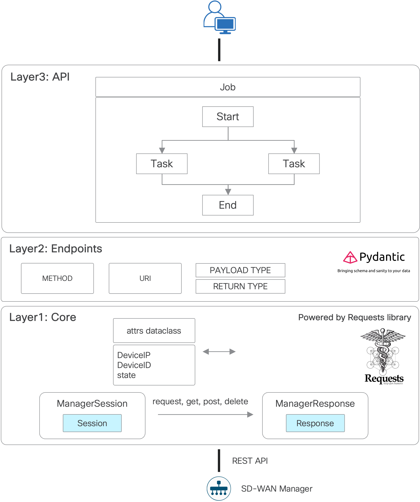

# Catalyst SD-WAN Python SDK Examples

catalystwan client is a package for creating simple and parallel automatic requests via Cisco Catalyst Manager API.
It is intended to serve as a multiple session handler (provider, provider as a tenant, tenant).
The library is not dependent on environment which is being run in, you just need a connection to any vManage.



Check it out:

- https://github.com/cisco-open/cisco-catalyst-wan-sdk
- https://pypi.org/project/catalystwan/

This repository just gives a few examples of how to use catalystwan SDK.

## Installation

Create virtual environment:

```example
% python3 -m venv .venv
```

Activate virtual environment:

```example
% source .venv/bin/activate
(venv) %
```

Upgrade initial virtual environment packages:

```example
(venv) % pip install --upgrade pip setuptools
```

Install required Python packages:

```example
(venv) % pip install -r requirements.txt
```

## Usage

Make sure you have the below environment variables defined in .venv file:

- vmanage_host
- vmanage_user
- vmanage_password

Use `export catalystwan_devel=true` if you want to have debug messsages.
They will be dumped into catalystwan.log file.

Python examples organized as follows:

- `requests` folder: examples based on the requests library (without catalystwan SDK usage)
- `raw` folder: examples based on catalystwan layer1
- `endpoints` folder: examples based on catalystwan layer2, endpoints
- `api` folder: examples based on catalystwan layer3, user APIs
